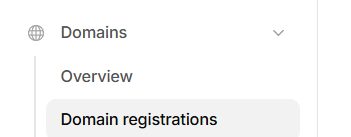
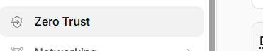
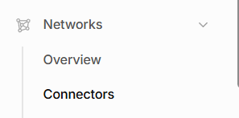
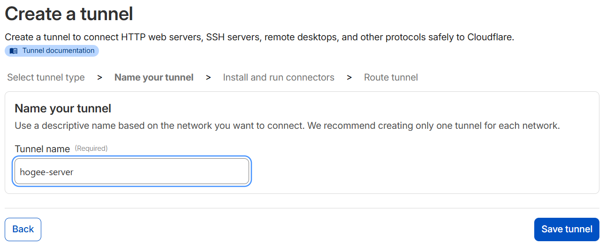
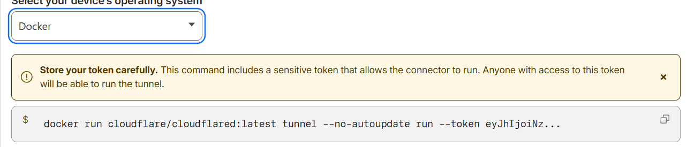
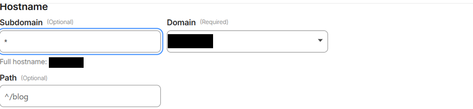
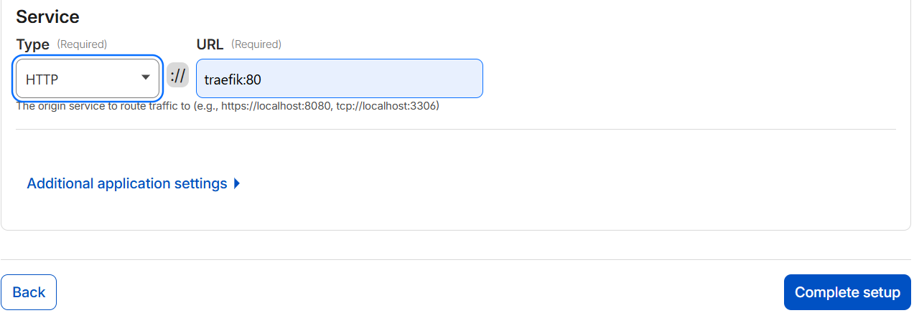

# Traefik + Authelia 2FA Docker Stack

Traefikをリバースプロキシとして使い、任意のDockerコンテナに対してホスト名単位の強力な認証(二要素認証対応)を追加するためのテンプレートです。

## 🌟 特徴
* **簡単セットアップ**: 秘密鍵（JWT_SECRET等）を初回起動時に自動生成
* **二要素認証 (2FA)**: AutheliaによるTOTP認証を標準サポート
* **SSL対応**: TraefikによるLet's Encrypt自動更新
* **柔軟な認証**: `users_database.yml` によるファイルベースのユーザー管理

## セットアップ方法 従来型ポート開放による公開

- .envへドメインなどの設定を行ってください

  .envは、env.templateをコピーして作成してください。

  ```
  AUTHELIA_ISSUER=Authelia
  ACME_EMAIL=xxxxx@xxxx.com
  TIMEZONE=Asia/Tokyo
  DOMAIN=xxxxx.com
  AUTH_DOMAIN=auth.$DOMAIN
  DASHBOARD_DOMAIN=dashboard.$DOMAIN
  ```
- authelia/configuration.ymlへメールサーバの設定を行ってください。

  authelia/configuration.ymlは、authelia/configuration.template.ymlをコピーして作成してください。

  以下はgoogleのメールサーバを使用する場合の設定です。

  ```
  notifier:
    smtp:
      address: 'submission://smtp.gmail.com:587'
      timeout: 5s
      username: "xxxxxxxxxxxxxxxxxxxxx@gmail.com"  # google mail address
      password: "xxxxxxxxxxxxxxxxxxxxxxx"  # 発行した16桁のアプリパスワード（スペースは詰めてもOK)
      sender: ""
      identifier: "localhost"
  ```
## cloudflare経由で接続する方法

- docker-compose.override_cloudflare_tunnel.ymlの有効化
  docker-compose.override_cloudflare_tunnel.ymlにcloudflareトンネルベースでの接続設定を行っています。
  
  次のコマンドでdocker-compose.override.yml へコピーして利用されるようにしてください。

  ```bash
  cp -p docker-compose.override_cloudflare_tunnel.yml docker-compose.override.yml
  ```
- cloudflareにログインし、Domain registrations にて使用するドメイン名を設定する



- Zero Trust ⇒ Networks ⇒ Connectorsをクリック 





- Create a tunnel ⇒ Select Cloudflared 任意のトンネル名を入力して Save tunnel



- Docker を選択 ⇒ docker ... のコマンド右のコピーアイコンをクリック



コマンドは次のようになっています。--token の隣 ey～最後までがトークンです。

```
docker run cloudflare/cloudflared:latest tunnel --no-autoupdate run --token eyxxxxxxxxxxxxxxxxxxxxxxxxxxxxxxxxxxxxxxxxxxxxxxxxxxxxxxxxxxxxxxxxxx9
```

トークンの値を、.envのCLOUDFLAR_TUNNEL_TOKENに指定してください。

```
CLOUDFLAR_TUNNEL_TOKEN=eyJhIjoiNzA1ZmNmMTJjODMyMmExNmY3YWU2MGY4MzRlYWIyZDAiLCeyxxxxxxxxxxxxxxxxxxxxxxxxxxxxxxxxxxxxxxxxxxxxxxxxxxxxxxxxxxxxxxxxxx9
```

- Next ⇒ サブドメイン * ドメイン選択 HTTP traefik:80 を入力 Complete setup





- docker compose でコンテナ起動

```bash
docker compose up -d
```


## autheliaユーザ登録方法

autheliaへのユーザ登録は、以下ファイルに対してユーザ情報を追加してください。

authelia/users_database.yml

authelia/users_database.ymlは authelia/users_database.template.ymlをコピーして作成してください。

パスワードのハッシュは次のコマンドにて生成できます。生成後に users_database.ymlのパスワード部分に転記してください。

docker compose exec -T authelia authelia crypto hash generate argon2 --password "hogehoge" | awk '{print $NF}'

## 関連資料

https://doc.traefik.io/traefik/

https://www.authelia.com/configuration/second-factor/duo/

## 別フォルダのコンテナを参加させる場合

- 別コンテナで使用可能なネットワークの作成

  ```bash
  docker network create traefik-public
  ```
- 使用ネットワークの変更

　次のファイルを作成し、使用ネットワークを外部化します。

  docker-compose.override.yml
  ```yml
  networks:
    traefik-public:
      external: true
  ```
- dokcerコンテナの再作成

  ```bash
  docker compose down && docker compose up -d
  ```

